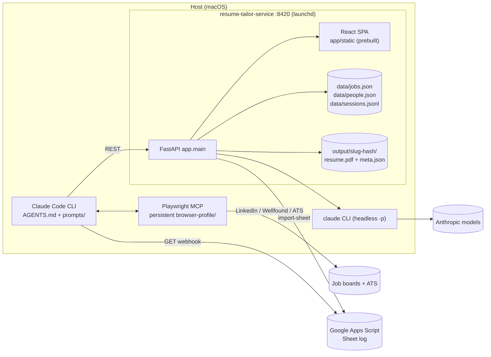
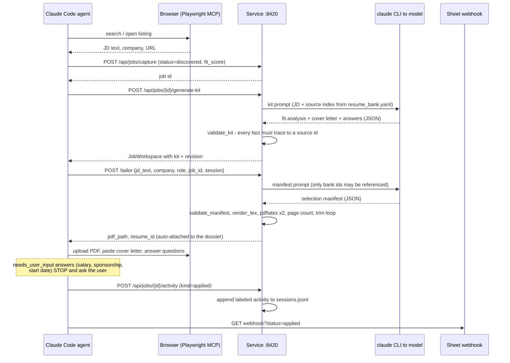
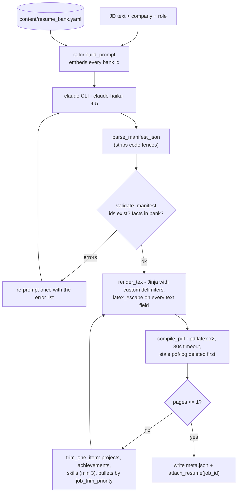
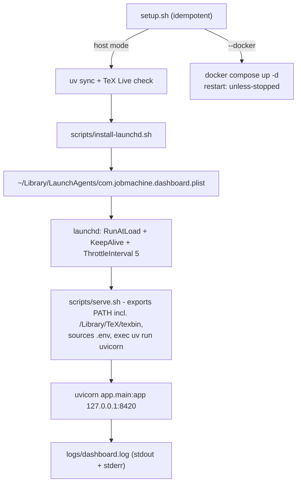

# Job Machine: End-to-End System Architecture

Last code and local-build verification: 2026-08-27. The RDS `job_registry` /
`jobs-pipeline` bulk-discovery lane has been removed; it no longer exists.
Launchd-specific claims below were last checked 2026-08-07 against
`job-search/push-2026-08-01` @ `8d151cb`.

---

## 1. What the system is

Two loosely coupled subsystems plus one agent driving them:

| # | Subsystem | Lives in | Runtime | Owns |
|---|---|---|---|---|
| 1 | **Agent / browser lane** | `AGENTS.md`, `prompts/`, `browser-profile/` | Claude Code CLI + Playwright MCP on the host | Searching, reading listings, filling and submitting forms, outreach |
| 2 | **Resume-tailor service** | `resume-tailor-service/` | FastAPI on `127.0.0.1:8420`, supervised by launchd | Inbox, dossiers, session history, tailored PDFs, application kits, people, dashboard UI |

Discovery is LinkedIn, Wellfound, and company ATS only. There is no RDS jobs
database and no local Postgres mirror.

Two external dependencies: the **Anthropic models** (reached through the local
`claude` CLI, no API key) and a **Google Apps Script webhook** (compact sheet log).



---

## 2. Control flow of one application

This is the contract in `AGENTS.md`, enforced by convention rather than by code.



---

## 3. Service internals

### 3.1 Module map

```
app/main.py          FastAPI app; /health, /tailor; mounts 4 routers; SPA last
├─ app/dashboard.py  /api/applications, /api/tailored/{id}[/pdf], /api/resume-bank
├─ app/jobs.py       /api/jobs …  CRUD, capture, decisions, job people,
│                    activity, restore, generate-kit, answers CRUD + generate
├─ app/people.py     /api/people CRUD
└─ app/sessions.py   /api/sessions summaries, filtered events, append

app/job_store.py     the real core. JSON store with threading.RLock,
                     atomic writes, revisions, activity log, dedup on capture
app/people_store.py  same pattern, simpler
app/session_store.py append-only JSONL narrative with per-session idempotency
app/application_kit.py  kit + answer generation AND their fact-traceability gate
app/tailor.py        prompt build -> model -> parse -> validate -> 1 retry
app/validate.py      manifest id + fact checks against the bank
app/render_tex.py    Jinja (LaTeX-safe delimiters) -> .tex
app/render.py        pdflatex x2 -> pypdf page count -> trim loop
app/bank.py          loads content/resume_bank.yaml (the only source of facts)
app/claude_cli.py    headless `claude -p --output-format json --model haiku-4-5`
app/sheets.py        reads the Apps Script sheet for import
app/models.py        Pydantic contracts shared by API + stores
```

The SPA is mounted **last** so `StaticFiles` can never shadow an
API route, and is guarded by an `is_dir()` check so the API still boots when the
frontend has not been built.

### 3.2 Resume tailoring pipeline (as built today)



Guarantees today: no invented ids, no facts outside the bank, always exactly one
page, always a real compiled PDF. **Not** guaranteed: that the output resembles
the canonical Overleaf resume. See §7.

Design details worth knowing:
- Jinja uses `((* *))` / `((( )))` / `((# #))` delimiters so LaTeX braces are not
  ambiguous, with `autoescape=False` and an explicit `latex_escape` on every
  interpolated string. URLs and emails stay raw because they go inside `\href{}`.
- `compile_pdf` unlinks the previous `resume.pdf` and `resume.log` before running,
  so `pdf_path.exists()` is evidence of *this* iteration succeeding rather than a
  leftover from an earlier trim attempt.
- The model is `claude-haiku-4-5`, switched from Sonnet because Sonnet timed out
  at 120s on this workload (`claude_cli.py:5-11`).

### 3.3 Kit / answer generation guardrails

`application_kit.py` is where the "never fabricate" rule is actually enforced in
code:

- `build_source_index(bank)` turns every bullet, skill line, and contact field
  into an addressable `source_id`.
- `validate_kit` tokenizes every generated fact and rejects any token that does
  not appear in the allowed source text (`_fact_is_traceable`).
- `_BANNED_COVER_PHRASES` blocks filler like "I'm passionate about".
- `_JUDGMENT_QUESTION_PATTERNS` detects salary / sponsorship / start-date /
  demographic questions and returns `needs_user_input=true` with a clarification
  instead of guessing. `AGENTS.md` rule 5 forbids bypassing that flag.

Commit `5ca2699` loosened this after over-strict traceability caused 502s on
`generate-kit`; `118a63b` allowed employer and project names in summaries.

### 3.4 Persistence

No database in the service. `data/jobs.json` and `data/people.json` are read and
written whole under process-local locks with atomic replacement. Each dossier
carries its own `activities[]` (append-only event log) and `revisions[]`
(restorable snapshots), so job history lives inside the record.
`data/sessions.jsonl` adds a cross-job, append-only narrative: explicit dossier
activities and Inbox mutations with a session label are mirrored there, while
direct browser/agent events use `POST /api/sessions/event`. External IDs are
idempotent within a session, reads and appends share a re-entrant lock,
malformed JSONL rows are skipped, and reads are bounded to the most recent 8
MiB. Mirroring is best-effort after the primary mutation so an auxiliary I/O
failure is logged without returning a false failure for data already saved.

People can be pinned to a dossier by `job_id`. Legacy people without a job ID
remain company-level and optionally role-specific. Inbox summary counts and
nested job people use the same association matcher. Nested creation compensates
by removing the new person if the target dossier disappears before its activity
can be recorded. People-store mutations use strict reads and refuse to
overwrite unreadable or malformed local data.

Timestamps are ISO 8601 UTC. Tailored PDFs are content-addressed by directory:
`output/<company-role-slug>-<8 hex>/{resume.tex,resume.pdf,meta.json}`.

`capture_job` is the idempotency point: it matches on company + role + URL,
patches only non-empty incoming fields, and when nothing actually changed writes
a `"Listing revisited"` activity instead of a no-op revision.

---

## 4. Deployment and CI



`install-launchd.sh` is the source of truth for the plist: it renders paths from
the repo location rather than hardcoding them, and `--check` diffs the installed
file against a fresh render, so drift is detectable. Verified in sync on
2026-08-07.

`serve.sh` vs `start.sh`: `serve.sh` is the non-interactive supervised entrypoint
(no mock sheet, never blocks on a TTY, `exec`s so KeepAlive restarts cleanly);
`start.sh` is the manual per-session runner that also starts the mock sheet when
`APPS_SCRIPT_URL` points at loopback.

**CI** (`.github/workflows/ci.yml`) is path-scoped to `resume-tailor-service/**`:

- **`tests`**: `uv sync --frozen` + `pytest -q` on a clean checkout with no
  `.env`. That absence is the assertion: the suite must not depend on local secrets.
- **`deploy-check`**: installs TeX Live first (without `pdflatex` the render
  tests skip themselves silently and the job would be green while the core path
  never ran), boots the service with the exact command launchd uses, asserts
  `/health` returns literally `{"status":"ok"}`, asserts `/` serves the committed
  SPA, then runs the full suite with rendering live.

`UV_PYTHON` is pinned to 3.12 so CI never drifts onto a Python newer than the
wheels the dependencies publish.

---

## 5. Verification state

| Check | Result |
|---|---|
| Backend suite (2026-08-27 working tree) | 222 passed |
| Dashboard test/typecheck/build (2026-08-27 working tree) | 2 tests passed; Vite 5.4.21, 1,604 modules |
| `GET /health` (2026-08-27 isolated server) | `200`, `{"status":"ok"}` |
| Inbox dashboard smoke test (2026-08-27) | real ticket list/detail rendered; Dossiers navigation worked; no browser console errors |
| `GET /api/sessions`, `/launch.html` (2026-08-27) | both `200` |
| launchd agent (2026-08-07) | `state = running`, pid 4184, never exited |
| plist vs `install-launchd.sh` (2026-08-07) | in sync |
| CI, latest 3 runs | success (`31136508123` on this branch) |

---

## 6. Prior audits and current integration

The 2026-08-01 and 2026-08-05 Codex sessions wrote no code or commits. Their
output was audit findings and approved designs:

**2026-08-01, resume tailoring audit.** Traced the pipeline and found the core
mismatch: the service does not edit the canonical resume. It rebuilds a new
document from `resume_bank.yaml` through a Jinja template and deletes whole
projects, achievements, skill rows, and bullets to force one page. It also noted
that the 150 passing tests confirm the *existing* design only. Nothing asserts
the base layout is preserved or that only approved words changed. In the same
session it drove a design round that was approved: a **Resume Operations
Console** (queue / live PDF / verification + logs / Approve + Regenerate) on top
of a **durable SQLite priority-FIFO queue**, so waiting on an approval never
occupies a worker.

**2026-08-05, deployment audit.** Verified the CI + launchd work end to end:
plist byte-identical and lint-clean, service answering with the exact health
body, both committed SPA assets served, GitHub run `31061901006` green with the
real pytest totals. One false alarm along the way: loopback was blocked by its
own command sandbox, not by the service. That session ended without a written
final report.

**2026-08-27, Inbox/session integration.** The working tree adds a default
ticket-style Inbox, a concurrency-safe server-side decision command,
guarded status transitions, job-specific people with legacy fallback,
append-only session events, data backup tooling, and matching backend/frontend
contracts. Generated SPA assets ship with the source so the Python-only
runtime still serves the current UI.

### Open gaps

1. **The canonical verifier is designed but not built.**
   `docs/superpowers/specs/2026-08-03-canonical-resume-tailoring-verifier-design.md`
   (456 lines, commits `aa2e42a` / `08e5dda`) specifies baseline pinning,
   word-level patch manifests, and fail-closed base-vs-tailored verification
   across text, page geometry, fonts, warnings, anchors, and pixels. No
   implementation exists in `app/`. Searching for verification concepts hits
   only `application_kit.py`'s fact traceability, which is a different check.
2. ~~**`harshsaw.tex` is still the 1-byte placeholder.**~~ **Done 2026-08-07.**
   The canonical trio now lives at the repo root: `harshsaw.tex` restored from
   `8be286f`, and `resume.cls` recovered from the Codex transcript that supplied
   it, both matching the spec's pinned SHA-256 values exactly. Provenance and
   rebuild invariants are pinned in
   `resume-tailor-service/content/canonical_baseline.json` and guarded by
   `tests/test_canonical_baseline.py` (7 tests), which proves a fresh compile
   reproduces the published base PDF: 1 page, 612x792, identical font set,
   identical normalized text, and only the one known Overfull hbox warning.
3. **The approved tailoring queue + console is unbuilt.** No SQLite tailoring
   queue, worker pool, or resume approval console exists; tailoring is still
   synchronous inside the `/tailor` request. The dossier Inbox added in 2026-08
   is a separate job-decision workflow.
4. **CI covers the service only.** No build, typecheck, or test for `dashboard/`
   (the SPA ships as committed `app/static/` assets).
5. **No auth, by design.** Loopback-only; the token gate was removed in
   `eacc562`. Correct for a single-user local tool, and a hard blocker to ever
   exposing this beyond `127.0.0.1`.
